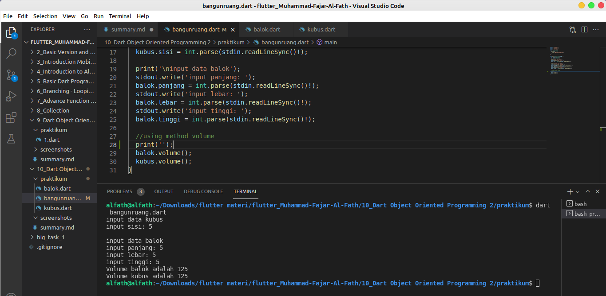

# 10_Dart Object Oriented Programming 2
## Resume
pada section ini telah dipelajari OOP advance pada bahasa pemogran dart. Tidak jauh berbeda dengan OOP lainnya konsep OOP dalam dart masih sama. Berikut poin-poin yang telah ditangkap pada section 10:
## 1. Constructor yang membuat objek simple dan Overriding si peniru method bagi inheritance
Constructor pada dasarnya merupakan method hanya saja berbeda dengan method biasa, constructor dibuat agar objek yang diciptakan dapat langsung menerima data berdasarkan parameter yang telah diberikan. Inheritance pada OOP merupakan sebuah class anak dari class induk yang dapat mewarisi property ataupun method dari class induk tersebut. Inheritance ditandai dengan extends. Overriding merupakan teknik untuk menulis method yang sama dari class induk akan tetapi mengubah proses didalamnya.
```dart
class Manusia {
    Manusia(){
        var mata = 2;
        var kaki = 2;
        var tangan = 2;
    }

    menghitung(int a, int b){
        var c = a+b;
    }
}

Class Anak extends Manusia{
    @override
    menghitung(int a, int b){
        var c = a*b;
    }
}
```
## 2. Penggunaan Import
import digunakan ketika kita mengaplikasikan inheritance, class induk yang dibuat di file berbeda harus diimport agar dapat diakses di file lainnya.
## 3. Tugas Membuat Class bangunruang dengan method overriding
pada tugas ini diperintahkan untuk membuat sebuah method volume yang dapat menghitung volume pada class kubus dan balok. Agar code lebih effisien maka dapat digunakan method overriding agar dapat membuat sebuah method yang sama akan tetapi berbeda proses. 
berikut hasil tugas task 1 yang telah dikerjakan:
