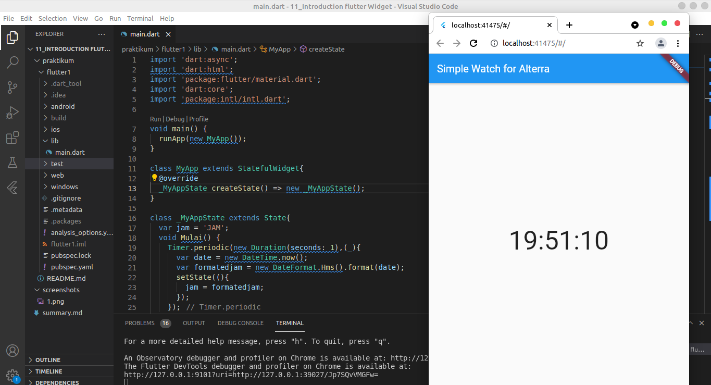

# 11_Introduction Flutter Widget
# Resume
## 1. Start Flutter
flutter dapat di start dengan cara melakukan flutter run pada terminal. Sebelum itu pastikan plugin flutter pada code editor atau android studio sudah terinstall dengan benar. Untuk membangun sebuah aplikasi android dibutuhkan Android SDK. Oleh sebab itu pastikan semua bahan telah terinstall.
## 2. Widget
merupakan sebuah class yang mengatur bagian front end dari suatu aplikasi mobile.
terdiri dari dua yaitu:
### Stateless Widget
Widget yang data didalamnya tidak dapat berubah.
### 3. Statefull Widget
Widget yang data didalamnya dapat berubah.
### 4. Built in Widget
merupakan Widget yang terdapat didalam class dan dapat langsung digunakan. Contohnya text Widget.

### Soal 
Membuat sebuah jam yang angka nya bisa terus berubah. Kemudian memisahkan Widget yang dapat dipisah didalam program flutter tersebut.
Code yang digunakan:
```dart
//this program contain the answer from task 1 and task 2 section 11.

<!-- import 'dart:async';
import 'dart:html';
import 'package:flutter/material.dart';
import 'dart:core';
import 'package:intl/intl.dart'; -->

void main() {
  runApp(new MyApp());
}

class MyApp extends StatefulWidget{
  @override
  _MyAppState createState() => new _MyAppState();
}

class _MyAppState extends State{
  var jam = 'JAM';
  void Mulai() {
    Timer.periodic(new Duration(seconds: 1),(_){
      var date = new DateTime.now();
      var formatedjam = new DateFormat.Hms().format(date);
      setState((){
        jam = formatedjam;
      });
    });
  }

 @override 
 void initState(){
   Mulai();
   super.initState();
 }

@override
Widget build(BuildContext context) {
  return new MaterialApp(
    home: new Scaffold(
      appBar: new AppBar(
        title: const Text('Simple Watch for Alterra'),
       ),
      body: Center(
        child: Text(
          jam,
          style: TextStyle(fontSize: 50),
         ),
       ),
     ),
   );
  }
}
```

hasil dari code tersebut sebagai berikut:
