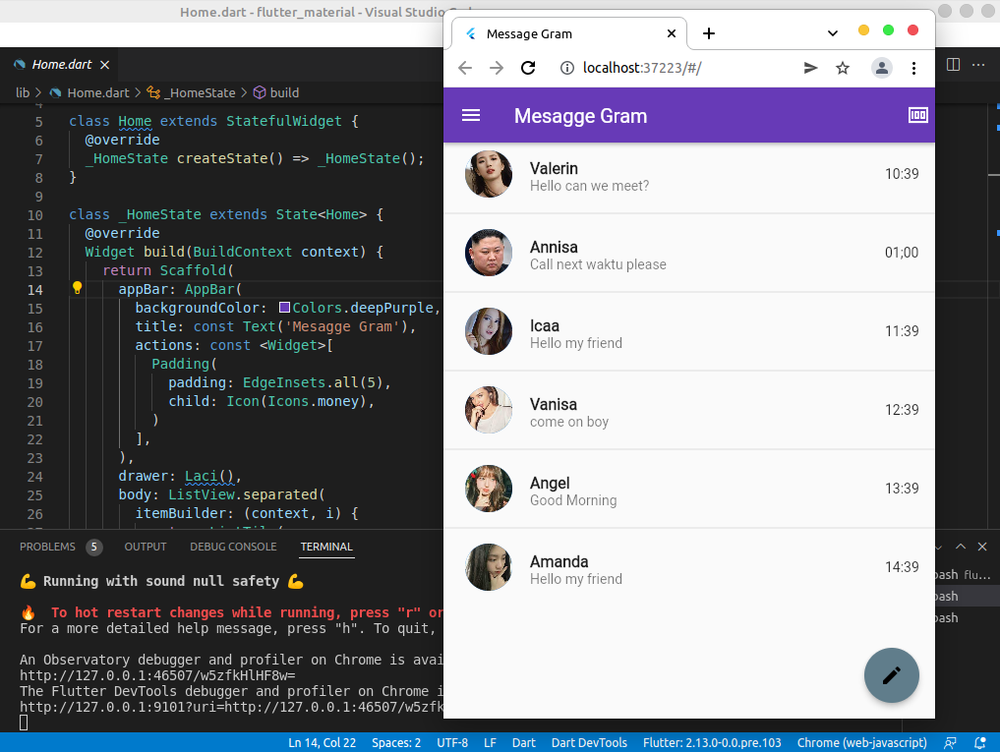
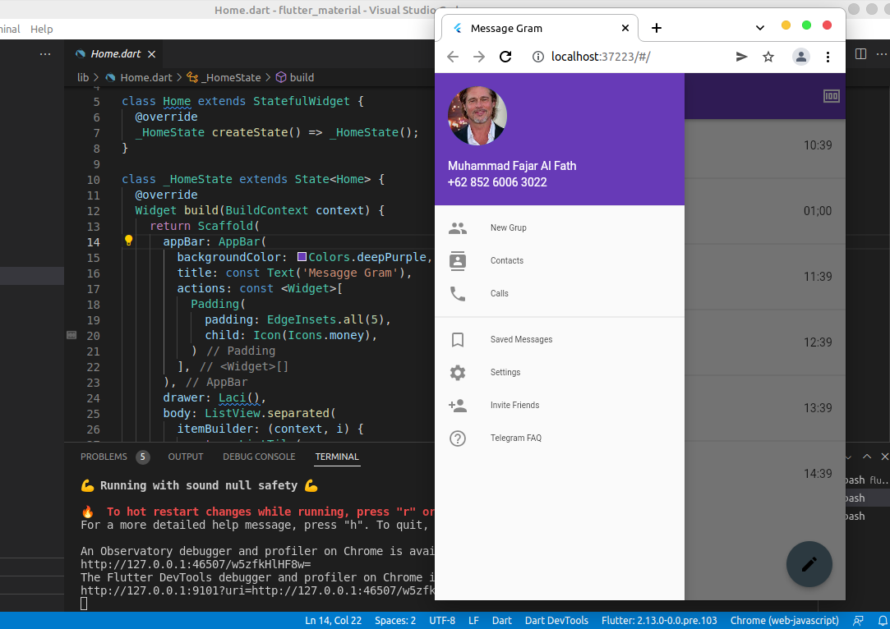
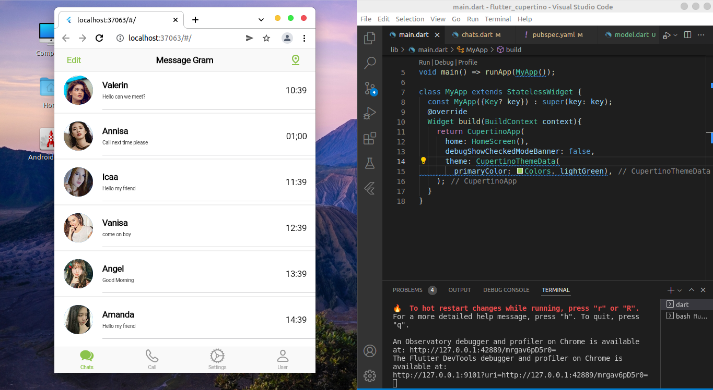

# 12_Platform Widget
# RESUME
Pada praktikum kali ini telah dipelajari dua widget utama yang membangun sebuah aplikasi mobile. Widget-widget ini berfungsi sebagai widget utama yang mengemas widget-widget lainnya dalam sebuah program. Pada dasarnya Widget ini terbagi dua yaitu material App untuk android platform dan Cuppertino App untuk ios platform.
# Material App
Widget utama yang membangun aplikasi android.
# Cuppertino App
Widget utama yang membangun aplikasi IOS.
# Scaffold
Widget yang berfungsi sebagai pembangun sebuah halaman aplikasi. Baik Material App dan Cuppertion App dapat menggunakan Widget ini.
# Membuat Ui Telegram home dan Drawe
Dalam membuat Ui ini diperlukan bagian home, main, drawer dan model. Home untuk mengisi bagian awal tampilan ui, drawer untuk membuat bagian drawernya, main untuk memulai aplikasi dan model sebagai list penyimpanan data chats. Berikut hasilnya:
## Gambar 1
)
## Gambar 2

# Membuat Ui Message Ios
Dalam membuat UI ini diperlukan bagian main, home, model dan chats. Bagian chats berisi  tampilan untuk chatnya, bagian model berisi list data chat dan bagian home berisi cupertino navigation dan cupertino bar. Berikut hasilnya:

