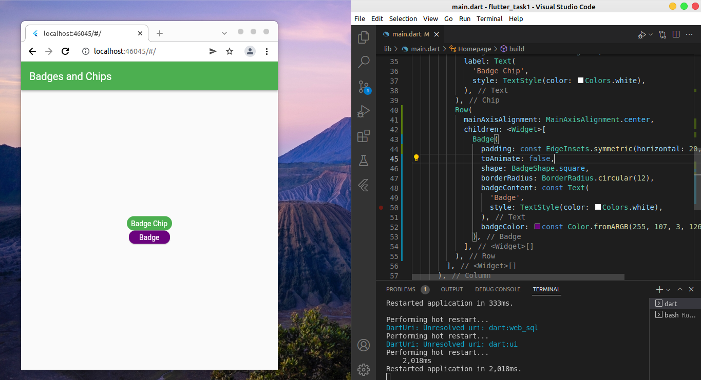
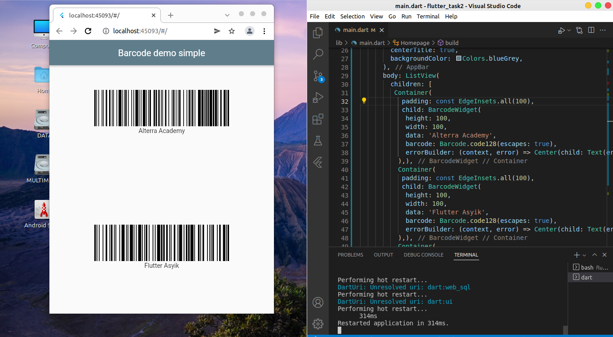

# Flutter Command Line and Flutter Package Management
# Resume
## Point 1
Terdapat CLI dalam flutter yang memudahkan pengoperasian flutter dengan command line. Diantaranya terdapat flutter doctor untuk mengecek kesehatan software, Flutter run untuk menjalankan flutter di web dan masih banyak command lainnya.
## Point 2
Flutter mengizinkan share package pada platformnya yang memudahkan para programmer untuk menggunakan package yang telah disediakan oleh developer lain. Salah satu dari package tersebut adalah CupertinoListTile yang dapat membuat list tile pada CupertinoApp.
## Point 3 
Untuk menambahkan package pada project flutter maka dapat dilakukan pub get di command line. Sebelumnya harus ditambahkan terlebih dahulu nama package dan version dari package tersebut.
```dart
dependencies:
    CuppertinoListTile : ^1.0.1
```
## Praktikum
1. Membuat sebuat badge dengan package badge. Hasilnya sebagai berikut:

2. Membuat 3 buah barcode dengan pakcage barcode, berikut hasilnya:
