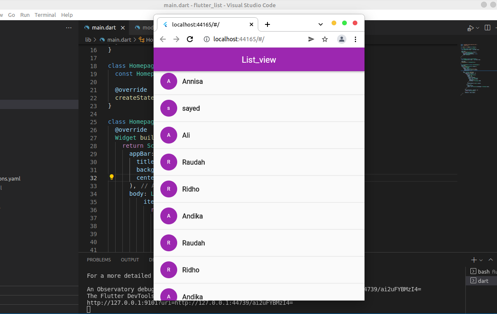
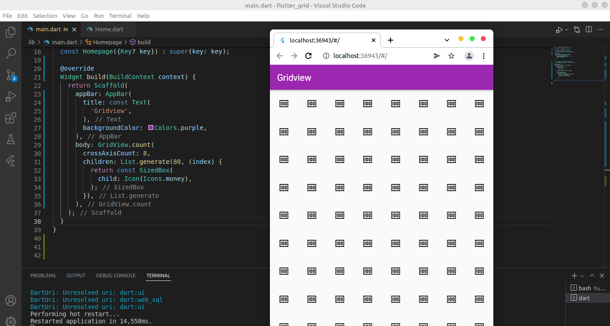

# 14_Flutter Layout
## Resume
## 1. Layouting
Dalam membuat user interface aplikasi mobile diperlukan layout untuk mengatur tampilan dan letak widget yang akan ditampilkan. Pengaturan layouting dapat dilakukan di body dengan berbagai widget seperti container, sizedbox, center dan lain-lain. Layout sangatlah penting untuk dikuasai oleh seorang programmer agar dapat membuat sebuah tampilan yang menarik dan disukai user.
Contoh :
```dart
Container: (
    child : Text('ini container'),
),
```
## 2. Multi child layout
Merupakan widget yang mengatur layout lebih spesifik lagi. seperti column untuk baris secara vertikal dan row untuk baris secara horizontal. Terdapat juga Listview untuk menampilkan widget secara list dan scrollable dan gridview untuk membuat tampilan seperti galeri. Contoh 
```dart
Column: child(
    Text('ini column'),
),
```
## Tugas
1. Membuat sebuah tampilan list view chat. Dalam tugas ini dibuat dua buat file yaitu file main.dart dan file model.dart. File main berisi initiate void main dan class Homepage yang mengatur tampilan awal dari aplikasi sedangkan Class Model berisi data-data chat yang akan ditampilkan di homepage. Berikut hasilnya:

2. Membuat sebuah tampilan grid view. Hasil:
