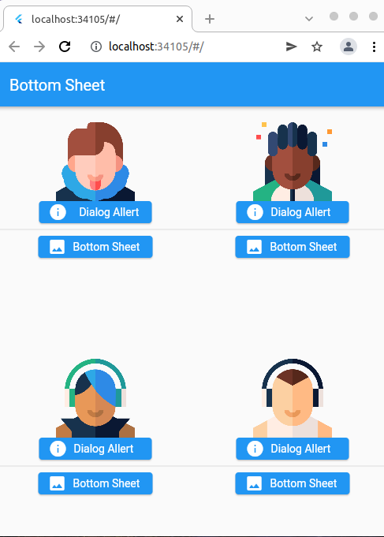
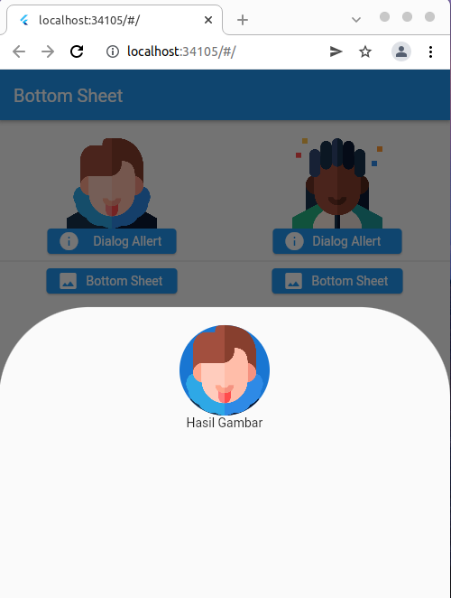
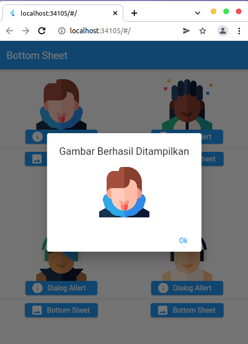

# Summary Section 15 Dialog Bottom Sheet
## Resume
### Bottom Sheet
Terdiri dari dua hal penting yaitu:
### 1. AlertDialog
Merupakan sebuah Widget yang dapat menampilkan popup alert pada layar ui mobile, biasanya didalam alert terdapat action dan tittle. Dalam menampilkan alertdialog diperlukan method Showdialog yang akan menampilkan si alert.
### 2. Bottom Sheet
Merupakan sebuah method yang dapat menampilkan sebuah sheet dari bawah. Sheet tersebut dapat kita isi dengan berbagai widget seperti form dan button. Dalam menggunakan Bottom Sheet harus menggunakan method showModalBottomSheet().
### 3. Galeri 
Galeri ini dapat menampilkan gambar-gambar yang terdiri dari button alert dan button bottom sheet. Masing-masing dari button memiliki action tertentu sesuai dengan namanya. Button alert ketika ditekan akan menampilkan alert pop yang berisi button dari imaga yang dituju sedangkan, button bottom sheet ketika ditekan akan menampilkan modal sheet dari bawah berisi image yang dituju. Berikut hasilnya:
### Tampilan Awal

### Tampilan Button Bottom Sheet

### Tampilan Button Alert

