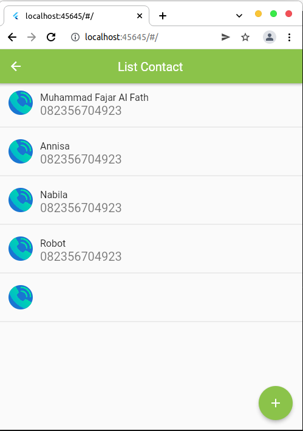
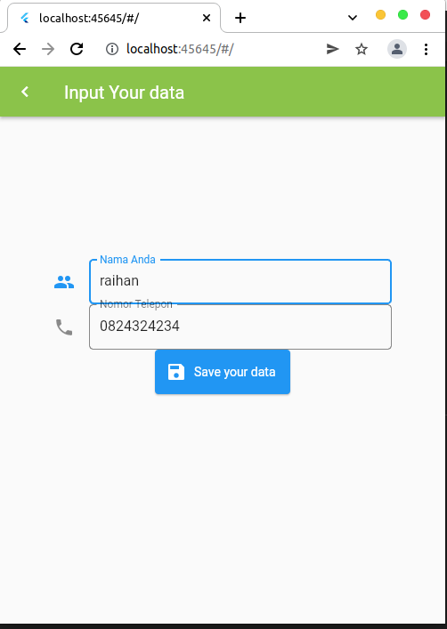
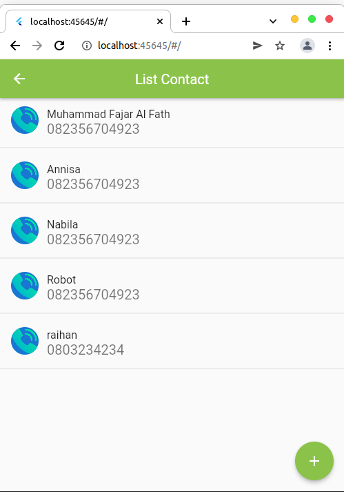

# Section 16 Form Input Button
## Resume
### 1. Form 
Form merupakan sebuah widget yang berfungsi sebagai tampilan formulir. Di dalam form terdapat berbagai widget salah satunya adalah TextFieldWidget. 
### 2. Text Field
TextFieldWidget merupakan sebuah widget yang berfungsi sebagai inputan dari user. Dengan adanya text field user dapat menginput sesuatu kedalam form tersebut.
### 3. Validation
Validation merupakan sebuah kondisi dimana apabila form tidak terpenuhi maka form tidak dapat mengambil nilai tersebut.
### 4. Form Widget Aplikasi
Dalam form ini di buat sebuah tampilan onboarding, tampilan list no telefon dan sebuah form input untuk menambah list contack. Berikut hasilnya:
#### 1. Tampilan onboarding

#### 2. Tampilan List contactk

#### 3. Menambah data

#### 4. Hasil tambah data
