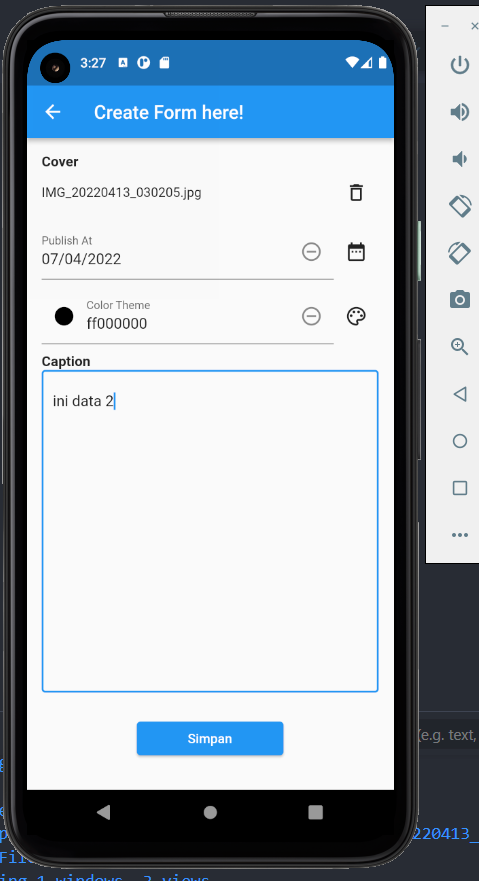
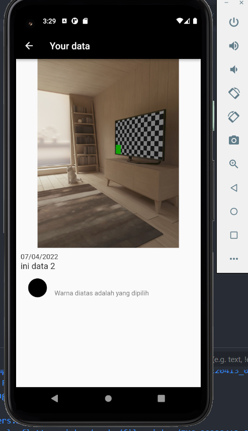

# Summary 17 Form Picker

pada praktikum ini, saya membuat sebuah form yang berisi textfield untuk menginput color, date, text, dan file gambar.
berikut yang diperlukan untuk membuat form ini:

## 1. Color picker, date picker, file picker dan controller

harus diinisialisasi terlebih dahulu di bagian pubspec terlebih dahulu.

## 2. Menggunakan setState untuk memperbaharui data.

## 3. Tidak boleh null

jika terdapat null maka akan terjadi exception yang kadangkala membuat aplikasi crash.

## 4. menggunakan inkwell agar gambar bisa ditampilkan di halaman baru

### Berikut hasil aplikasi yang telah dibuat:

### Form

### result

