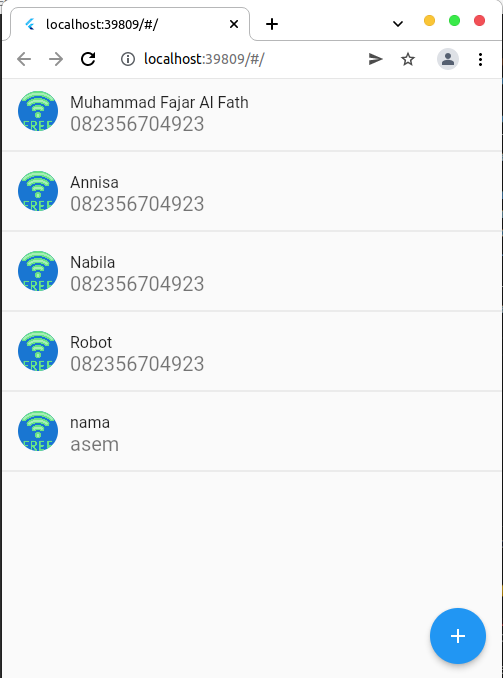
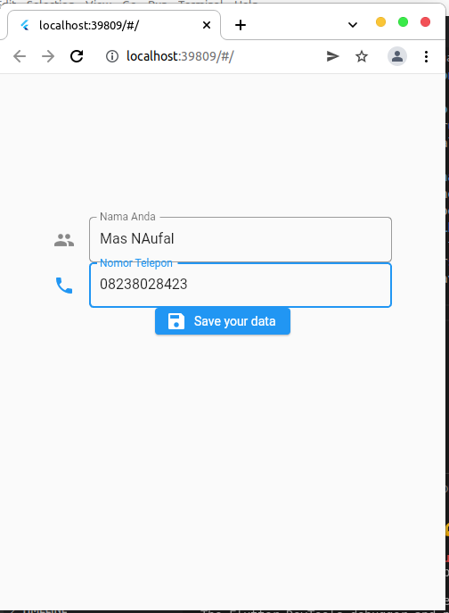
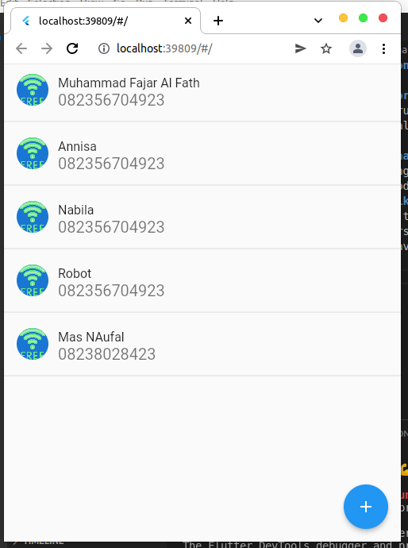

# Summary Flutter Navigation
## Resume
### 1. Flutter navigation original push and pop
navigation push and pop merupakan navigasi general yang biasa digunakan di flutter. Menggunakan material push kemudian membawa ke halaman selanjutnya. Untuk kembali dapat menggunakna pop. Logika yang digunakan adalah first in last out.
### 2. Flutter navigation namedroute
Perbadaan material push dengan namedroutepush adalah penamanaan inisial dari halaman yang ingin dituju, hal ini memudahkan penulisan code yang lebih singkat dan lebih cepat daripada menggunakan material push.
### 3.  Membuat sebuah aplikasi contact
Pada aplikasi ini terdapat tampilan list yang menampilkan list contact yang kita punya kemudian, kita dapat menambahkan daftar list tersebut melalui button yang akan menampilkna form input contact. Aplikasi ini dibuat menggunakan versi navigation material push dan namedroute.
### Berikut hasilnya:

### Ketika masuk ke screen berikutnya

### Ketika push data dan membawa nya ke screen sebelumnya
