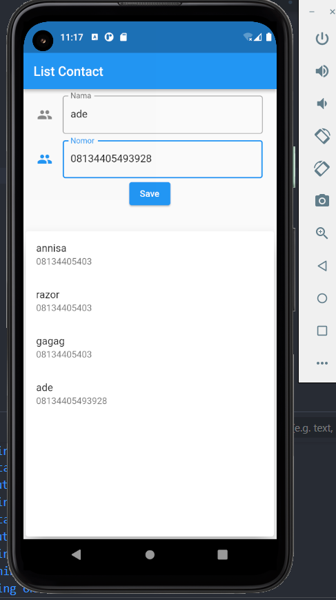

# Summary Flutter State Management provider

Pada materi kali ini saya mempelajari provider. Dimana provider merupakan suatu tool yang memiliki fungsi untuk merubah state pada ui sesuai dengan kondisi yang diberikan.

## Provider

Untuk menggunakan provider harus lah diinisalisai di bagian pubspec.yml. agar datap digunakan di bagian project.

## Initiate Main

Inisialisasi bagian main dengan multiprovider kemudian di bagian child baru materialApp. Dengan begitu seluruh Bagian dari material APP dapat menggunakan provider dengan menginmpor file dan membuat variable final provider nya

## List Contact menggunakan provider

Dalam program ini membuat sebuah list contack yang dapat menyimpan data di dalam state menggunakan provider berikut hasilnya

### Hasil satu

### Hasil List

