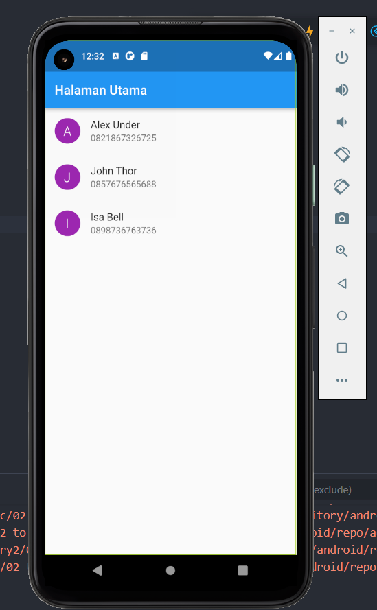

# Summary Introduction Rest Api-Json

## 1. Rest Api merupakan sebuah jembatan penghubung antara server dengan aplikasi yang kita gunakan. Ketika Aplikasi merequest data atau mengirim data maka API diibaratkan jalan tol yang menghubungkan aplikasi ke server. API biasanya berbentuk file JSON.

## 2. Menggunakan API dapat digabungkan dengan penggunaan Provider, setstate ataupun BLoC.

## 3. Dalam menggunakan API terdapat beberapa cara. Cara paling umum menggunakan DIO, HTTP atau CRUD.

## berikut implementasi request menggunakan http pada API sederhana contacts.

