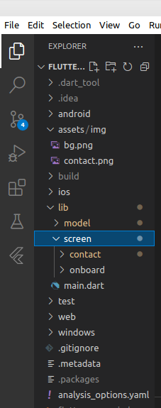

# Summary MVVM Arsitektur
## 1. Merupakan sebuah model peletakkan folder yang memisahkan antara logic dengan tampilan.
## 2. Keuntungannya mudah di reusablity atau pemakaian yang berulang sehingga programmer tidah susah-susah membuat logic atau pun ui yang sama.
## 3. Memudahkan pembacaan code dan pengecekan error
## contoh dari MVVM dapat dilihat di gambar berikut:
