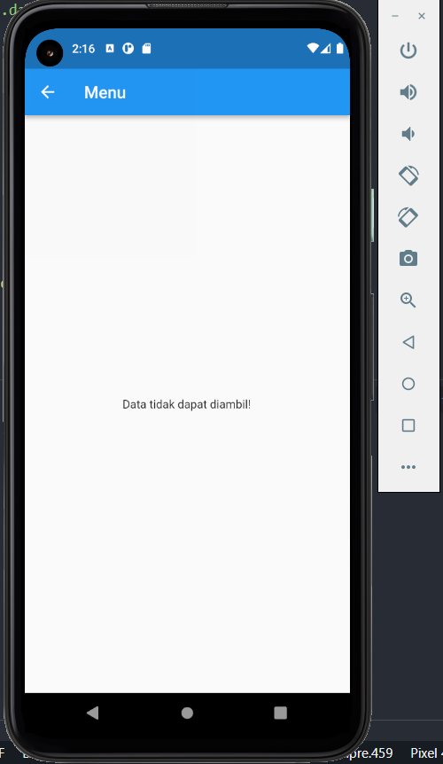

# Summary Finite State dan Unit Testing

## 1. Finite State merupakan sebuah maching yang menyimpan banyak state dimana, tiap state menunjukkan proses yang terjadi sebelumnya

1. None tidak ada proses yang terjadi
2. Running ketika proses sedang terjadi
3. Error ketika proses gagal

## Contoh Implementasi Error

## Contoh Implementasi Running

