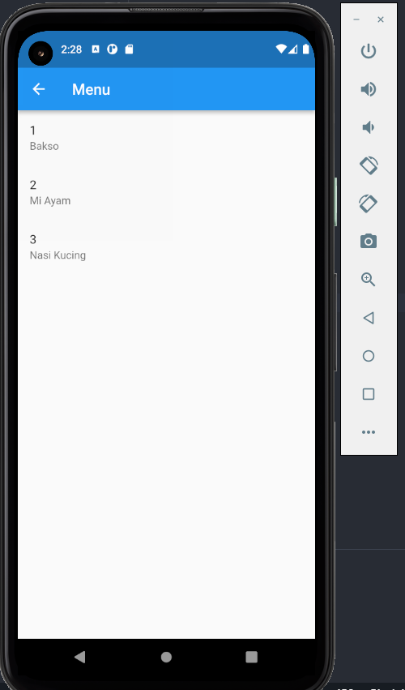

# Summary Finite State dan Unit Testing

## 1. Finite State merupakan sebuah maching yang menyimpan banyak state dimana, tiap state menunjukkan proses yang terjadi sebelumnya

1. None tidak ada proses yang terjadi
2. Running ketika proses sedang terjadi
3. Error ketika proses gagal

## Contoh Implementasi Error

## Contoh Implementasi Running

## 2. unit test merupakan sebuah test yang dilakukan pada method ataupun fungsi, terdapat berbagai cara dalam melakukannya baik manual ataupun scripted
## contoh implementasi scripted

## 3. Mocking merupakan sebuah test yang dilakukan pada method atau fungsi tetapi memisahkannya dengan fungsional eksternal seperti pengambilan data API di server dll.
## implementasi mocking

## Keunggulan dan kekurangan. 
1. Jika menggunakan script test maka proses eksternal tidak akan dipisahkan sehingga dapat langsung dilakukan test terhadap method yang ada, code yang ditulis pun lebih simple. cocok untuk project skala kecil yang tidak memiliki banyak method karena cenderung lambat saat proses test.

2. Jika menggunakan mocking maka test akan berjalan lebih cepat. Hanya saja harus dibuat duplikat project yang ada agar tidak mengganggu project main. test lebih cepat sehingga cenderung bagus digunakan di project skala besar.
