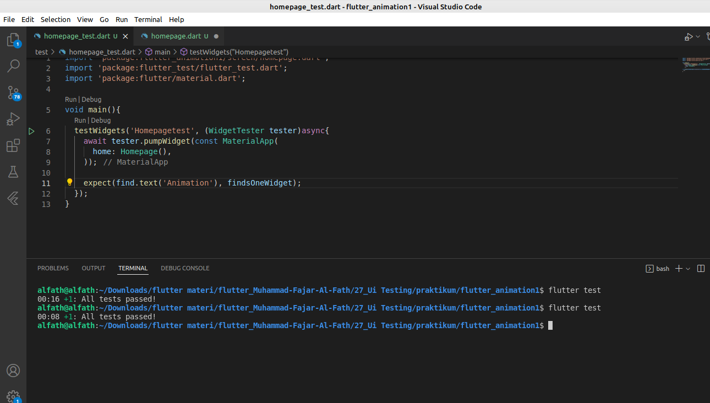
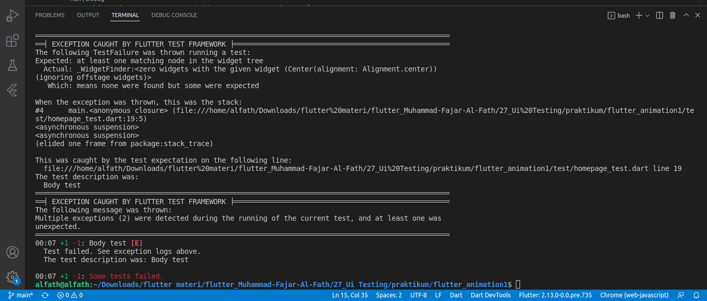

# Summary UI Testing
## 1. Perbedaan UI Testing dengan Unit Testing adalah UI Testing mengetes Widget dan UI nya sedangkan Unit Testing mengetes function yang digunakan seperti viewmodel dll.
## 2. Ui Testing memakai depedency yang sudah tertulis secara otomatis ketika kita mengenerate suatu project flutter yang baru
## 3. Ui Testing dapat dilakukan dengan menuliskan script berisi widget yang akan dites. Scrip tersebut harus berformat _test.dart dan diletakkan di folder test
## Berikut hasil Ui Test yang telah dilakukan succes

## Error ketika script yang ditulis tidak sesuai atau failed
