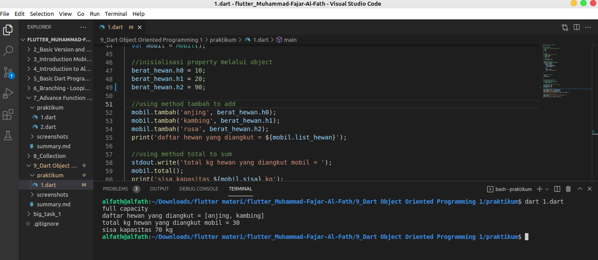

# Resume
## 9_Dart Object Oriented Programming 1
### 1. OOP
Merupakan methode penulisan code yang berbasis objek. Setiap code akan ditulisan dalam class yang memiliki property dan method masing-masing. Pada fungsi main atau fungsi lainnya class dapat dipanggil dan digunakan dengan cara membuat objek untuk class tersebut.
### 2. Class
merupakan blue print atau Cetakan dari suatu objek memiliki property dan method. Analogikan class sebagai manusia, manusia memiliki kaki dan tangan dalam class, kaki dan tangan dianalogikan sebagai property. Kaki dan tangan bisa bergerak, menendang dan memukul. Kegiatan tersebut dalam class disebut sebagai method. Analogi lainnya adalah sebagai berikut :
Class = Blueprint/Cetakan
Property = Bahan-bahannya/variable
Method = fungsi-fungsi yang dapat dilakukan di dalam class
### 3. Penulisan Code Program
Untuk Class dapat ditulis dengan:
```dart
class Berat_hewan{
  //berat hewan disimpan dalam bentuk kg
  var h0;
  var h1;
  var h2;
}
```
Untuk Property dapat ditulis dengan:
```dart
class manusia{
    var mata = 2;
}
```
Untk method dapat ditulis dengan:
```dart
  //method total muatan
  total(){
    print(temp);
  }
```
### praktikum
Pada praktikum kali ini membuat class hewan dan mobil. Class hewan berisi data berat hewan. Class mobil berisi list nama hewan, kapasitas mobil, method total angkutan dan method tambah hewan. Hasil dari program tersebut adalah sebagai berikut:


untuk program nya sebagai berikut:
```dart
//soal no 1 dan no 2 digabung
import 'dart:io';

class Berat_hewan{
  //berat hewan disimpan dalam bentuk kg
  var h0;
  var h1;
  var h2;
}

class Mobil{
  // property berat max dalam kg
  int maxkg = 100;
  int temp = 0;

  //property list nama;
  var list_hewan = [];

  //method tambah muatan
  tambah(String hewan, int berat){
    if (maxkg != 0){
      list_hewan.add(hewan);
      maxkg -= berat;
    }
    temp += berat; 
  }

  //method total muatan
  total(){
    print(temp);
  }
}

void main(List<String> args) {
  //inisialisasi object 
  var berat_hewan = Berat_hewan();
  var mobil = Mobil();

  //inisialisasi property melalui object
  berat_hewan.h0 = 10;
  berat_hewan.h1 = 20;
  berat_hewan.h2 = 30;

  //using method tambah to add
  mobil.tambah('anjing', berat_hewan.h0);
  mobil.tambah('kambing', berat_hewan.h1);
  mobil.tambah('rusa', berat_hewan.h2);
  print('daftar hewan yang diangkut = ${mobil.list_hewan}');

  //using method total to sum
  stdout.write('total kg hewan yang diangkut mobil = ');
  mobil.total();
}
```
