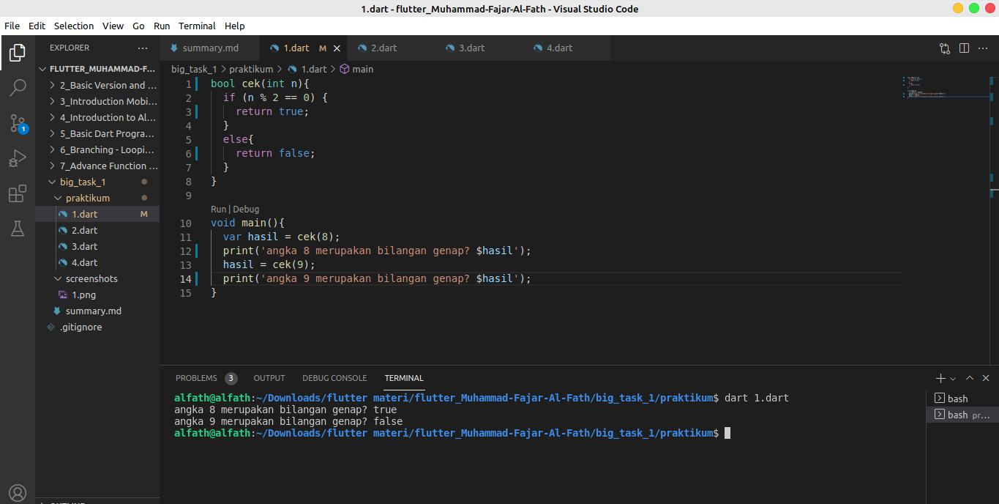
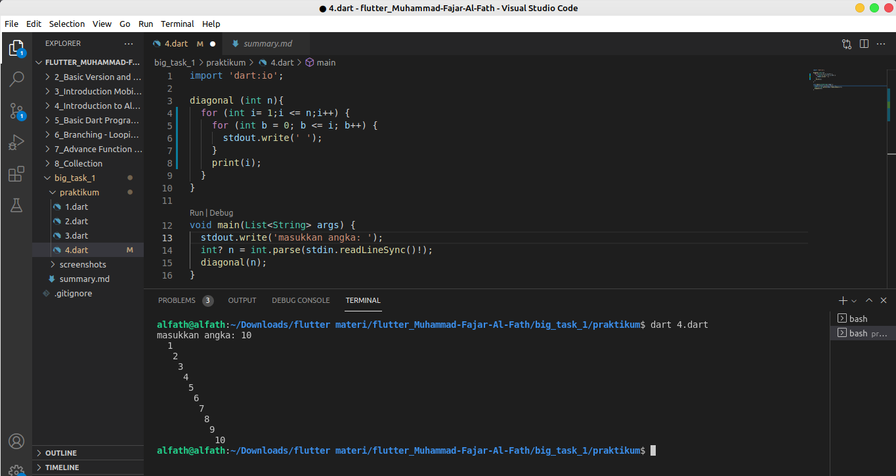

# Summary big_task_1
## 1
- membuat fungsi yang dapat menerima inputan
- mereturn true jika nilai yang diberikan genap
- merturn false jika nilai yang diberikan ganjil
jawab :
Untuk code nya sebagai berikut:
```dart
bool cek(int n){
  if (n % 2 == 0) {
    return true;
  }
  else{
    return false;
  }
}

void main(){
  var hasil = cek(8);
  print('angka 8 merupakan bilangan genap? $hasil');
  hasil = cek(9);
  print('angka 9 merupakan bilangan genap? $hasil');
}
```
hasil yang didapat adalah sebagai berikut


## 2
- membuat fungsi yang dapat menerima inputan
- jika masukan lebih dari 180 maka return -180
- jika masukan kurang dari 180 maka return masukan + 180
- jika return kurang dari atau sama dengan 0 maka return 0
- jika return lebih dari atau sama dengan 360 maka return 0

code :
```dart
import 'dart:io';

fungsi(int n){
   if (n > 180){
     return (n - 180);
   }
   else{
     return (n + 180);
   }
}

void main(){
  stdout.write('input angka: ');
  int? n = int.parse(stdin.readLineSync()!);
  int a = fungsi(n);

  if (a <= 0) {
    print('hasil 0');
  }
  else if (a >= 360){
    print('hasil 0');
  }
  else {
    print(a);
  }
}
```
hasil dari code tersebut adalah :


# 3 
- menerima sebuah angka
- membuat jam pasir dengan angka tersebut

code:
```dart 

```
untuk bagian no 3 masih unsolved.


# 4 
- menerima sebuah angka
- menampilkan angka secara diagonal

```dart 
  import 'dart:io';

diagonal (int n){
  for (int i= 1;i <= n;i++) {
    for (int b = 0; b <= i; b++) {
      stdout.write(' ');
    }
    print(i);
  }
}

void main(List<String> args) {
  stdout.write('masukkan angka: ');
  int? n = int.parse(stdin.readLineSync()!);
  diagonal(n);  
}
```
hasil nya adalah sebagai berikut:
